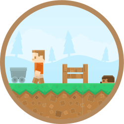

# Blockycraft

## Summary

Blockycraft is a Minecraft inspired Block Engine.

Blockycraft was first developed for a University of Waterloo graphics course. The [classic version](./classic/) of the project is available as `blockycraft-classic`.

## Unity Web Player

You can go to the following to play on the web.

